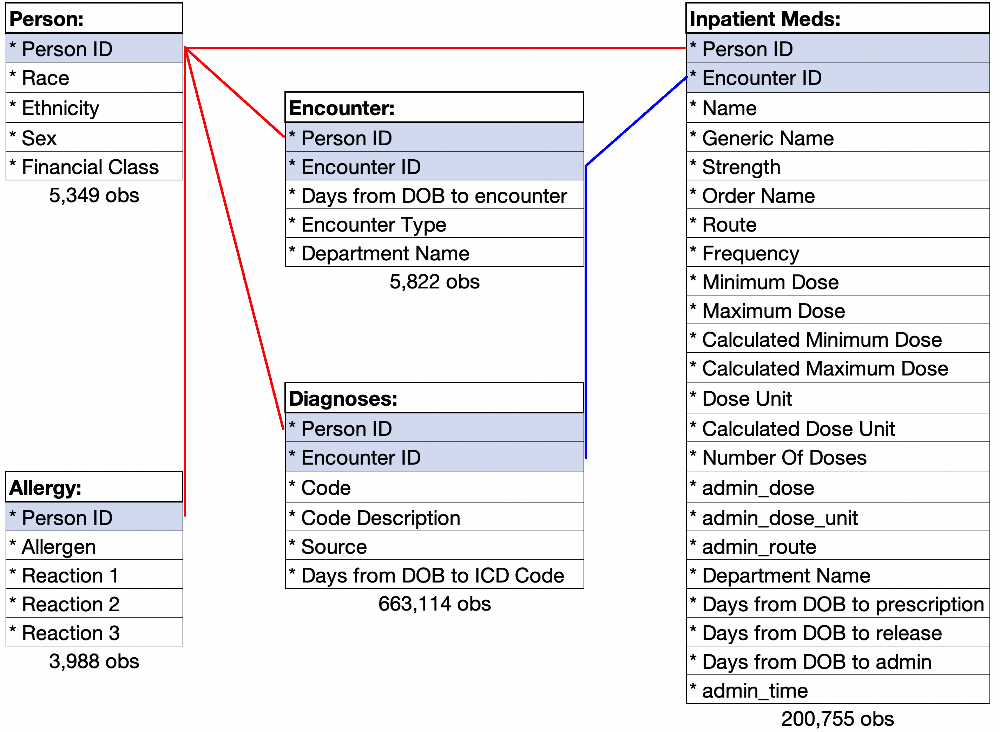
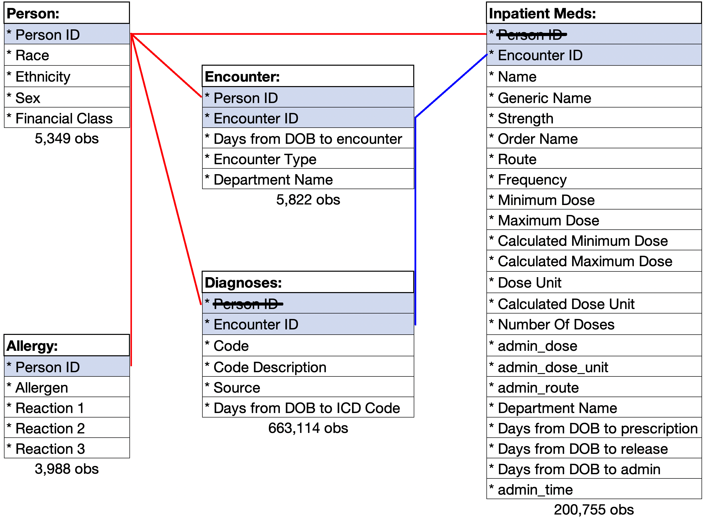

class: title-slide, center, middle
background-image: 
background-size: contain
background-color:black

```{r setup, include=FALSE}
options(htmltools.dir.version = FALSE)
knitr::opts_chunk$set(warning = FALSE, 
                      message = FALSE, 
                      collapse = TRUE,
                      fig.retina = 3)
library(tidyverse) # load tidyverse package
library(kableExtra)
load(file = 'data/demo.RData')
```

## `r rmarkdown::metadata$title`
# `r rmarkdown::metadata$subtitle`

### `r rmarkdown::metadata$author`

### `r Sys.Date()` 

#### <i class="fas fa-images"></i> `r paste0('https://slides.carolineledbetter.us/', params$slides)` 
<i class="fab fa-github-square"></i> `r paste0('https://github.com/ledbettc/slides/tree/master/', params$github)`
---
class:middle
name: details
<!-- edit slides and github repo in the YAML above -->

.intro[
#Find me at: 
]
.intro-right[
<i class = "fas fa-globe"></i> carolineledbetter.us  
<i class = "far fa-envelope"></i>
caroline.ledbetter@cuanscutz.edu  
<i class="fab fa-github"></i>
 @ledbettc  
<i class="fab fa-twitter"></i>
@C_line_sealion
]

---
layout: true
background-image: 
background-size: contain
.footer[`r paste0('https://slides.carolineledbetter.us/', params$slides)`]
---
class:center, top

.header[**The Data Analysis Plan**]

???
First thing we need is a well defined analysis. A clear research question 
with an exposure and an outcome. 
--

.left[
**Hypothesis:**  
{{content}}
]

--

Individuals with MDIS have higher rates of chronic pain post spinal surgery.  
{{content}}

--

**Inclusion Criteria:**  
{{content}}


--

Spinal procedure as defined by procedure codes  
{{content}}

--

**Exposure:**  
{{content}}


--

Multiple Drug Intolerance Syndrome  
{{content}}

--

**Outcome:**
{{content}}

--

Chronic Pain  
{{content}}

--

**Covariates:**  
{{content}}

--

Race, Ethnicity, Sex, Financial Class
{{content}}

???
What are our covariates? 
The better/more completely these are 
defined in advance the easier our life will be later. This will allow us to 
forsee potientinal issues, limitations, extra variables and biases. 
---
class: inverse, center
# Sample Plan  

<a href="https://slides.carolineledbetter.us/now_what/img/data_analysis_plan.pdf" target="_blank">data_analysis_plan.pdf</a>

---
class:top

.header[ .center[**Flat File vs Relational Data Tables**]  ]

--

.big[
.pull-left[
**Flat File**   
<br>
* self-contained   
* may duplicate information
]
]

--

.big[
.pull-right[
**Relational Data Tables**
* can be many tables
* connected keys (relations)
]
]

---
class: center, middle, inverse

# A tale of five tables...


---
class:center  

```{r, echo = FALSE, out.width = "90%"}

```

??? 
Relational tables are linked by 
---
class:center    

```{r, echo = FALSE, out.width = "90%"}

```

???
For a true relational database, information is not duplicated - why the 
person id and not the encounter id. There is a one to many relationship 
between person and encounter (an person may have multiple encounters, but
an encounter cannot have multiple people ). Removing the encounter id would 
not allow us to relink it (there are mutliple encounters for every person id)
---
class:center    

```{r, echo = FALSE, out.width = "100%"}

```


---
class: center


```{r, echo = FALSE, out.width = "70%"}

```

---
class: center


```{r, echo = FALSE, out.width = "100%"}

```

```{r, echo = FALSE, out.width = "70%"}

```

??? 
Anytime there is duplicate information, you increase your chance of errors. 
Joining two tables with multiple by columns can sometimes have unintended
consequences. 

---
```{r, echo = FALSE, out.width = "70%"}
knitr::include_graphics('img/flat_table.jpg')
```

???
If you were to put these three tables into a flat table there 
would be 
over 6 million lines. Think about all the duplicate information 
that is in this table and how hard it would be to get out simple information
like the number of males or worse the number of people with a certain dx code!

---
class:center, middle

<strong>
<blockquote class="twitter-tweet">
<p lang="en" dir="ltr">“EDA is never done. You just die” as 
<a href="https://twitter.com/RohanAlexander?ref_src=twsrc%5Etfw">@RohanAlexander</a> 
told an unsuspecting student <a href="https://t.co/0Lt8LRpkg7">https://t.co/0Lt8LRpkg7</a>
</p>
&mdash; Monica Alexander (@monjalexander) 
<a href="https://twitter.com/monjalexander/status/1234112608837537792?ref_src=twsrc%5Etfw">March 1, 2020</a>
</blockquote> 
<script async src="https://platform.twitter.com/widgets.js" charset="utf-8"></script>
</strong> 

---

```{r}
spinal_visits %>% 
  count(person_id) %>% 
  count(`No. of Spinal Encounters` = n, name = 'No. of Pts') %>% 
  kable() %>% 
  kable_styling(full_width = F)
```

---
class: center

```{r, echo = FALSE, out.width = "80%"}

```

---

```{r}
spinal_visits %>% 
  filter(is.na(as.numeric(days_from_dob_toencounter))) %>% 
  select(-DepartmentName) %>% 
  slice(1:5) %>% 
  kable() %>% 
  kable_styling(full_width = F) 
```

---

```{r}
allergy %>% 
  add_count(person_id) %>% 
  arrange(person_id) %>% 
  filter(n == 2) %>% 
  slice(7:16) %>% 
  kable() %>% 
  kable_styling() %>% 
  collapse_rows(1)
```

---

```{r, iecho  = FALSE}
inpatient_meds %>% glimpse
```

---

```{r, echo = FALSE}
# missing data for inpatient meds
inpatient_meds %>% 
  summarise_all(~ scales::percent(sum(is.na(.))/n(), accuracy = 0.001)) %>% 
  pivot_longer(cols = everything(), names_to = 'variable', 
               values_to = 'percent_missing') %>% 
  kable() %>% 
  kable_styling(full_width = FALSE)
```

---
class:center

# Diagnostic Tables
### ICD 9  
```{r icd_chronic_codes, echo = FALSE}
dx %>% 
  filter(str_detect(code, '^338\\.[24]')) %>% 
  count(code, code_description) %>% 
  kable() %>% 
  kable_styling(full_width = FALSE)
```

### ICD 10  
```{r, echo = FALSE}
dx %>% 
  filter(str_detect(code, '^G89\\.[24]')) %>% 
  count(code, code_description) %>% 
  kable() %>% 
  kable_styling(full_width = FALSE)
```

---


#Resources:   

.resources[
]
---
<!-- last slide go back to details slide -->
#[Return to Contact Info](#details)

