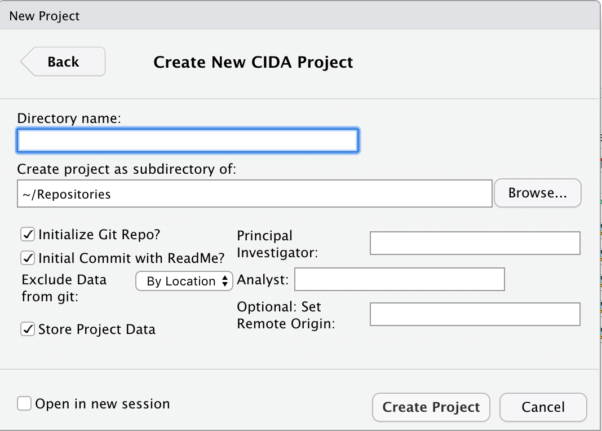

class: middle, left

```{r setup, include=FALSE}
options(htmltools.dir.version = FALSE)
knitr::opts_chunk$set(warning = FALSE, message = FALSE)

```

#**Why Rproject Templates?**  
--

#If you can automate you should automate
--

#Stardized file structures are easy for you and your collaborators to work with

---

.pull-left[
#**You need:**  

#an R project  

#Template Metadata  

#Template Function  
]
--
.pull-right[
```{r filestruct, echo = FALSE, out.width = "75%"}
 # update USERNAME here
```
]

---
class:center, middle

```{r hexsticker, echo = FALSE, out.width = "60%"}
 # update USERNAME here
```


---
class:center, middle

```{r newproject, echo = FALSE, out.width = "100%"}
 # update USERNAME here
```


---
```{r projectsetup, echo = FALSE, out.width = "100%"}
 # update USERNAME here
```

---

```{r eval = F, include = T}
proj_setup <- function(path, ...){
  # ensure path exists
  dir.create(path, recursive = TRUE, showWarnings = FALSE)
  dots <- list(...)
  attach(dots)
  on.exit(detach(dots))
  ProjectName <- paste0(path)

  ### Setup ReadMe Files ----
  readme <- c(paste0("# ", ProjectName, "  "),
              paste0("**PI:**", PI, "  "),
              paste0("**Analyst**:", analyst, "  "),
              "",
              "Details about the folders:",
              '',
              "File | Description",
              "---|----------------------------------------------------------",
              paste("Admin | contains the scope of work and other",
                    "administrative documents"),
              paste("Background | contains the background information for",
                    "the analysis"),
              "Code | contains all R scripts for this project"
              )

```

---
# Resources

Rstudio How To Guide:  
https://rstudio.github.io/rstudio-extensions/rstudio_project_templates.html

CIDAtools Github Repo:
[ledbettc/CIDATools](https://github.com/ledbettc/CIDAtools)

#Find me at: 
.pull-right[
carolineledbetter.us  

carolineledbetter@yahoo.com  

 @ledbettc  

@C_line_sealion
]


